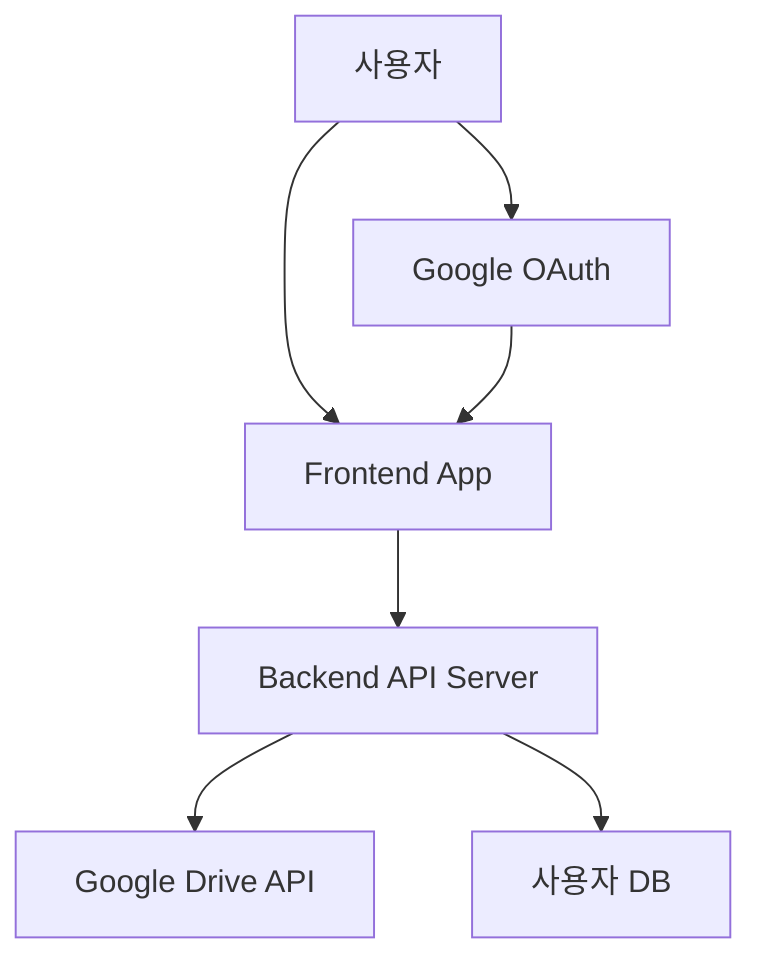

# Today's Backlog Design Document

## 개요

Today's Backlog은 개인 작업 관리를 위한 React 기반 웹 애플리케이션입니다. 이 문서는 Google Drive 연동 기능을 포함한 전체 시스템 설계와 구현 사항을 다룹니다.

## 주요 기능

### 기본 작업 관리
- ✅ 작업 생성, 수정, 삭제
- ✅ 작업 상태 관리 (백로그, 오늘 할 일, 완료)
- ✅ 우선순위 설정 (낮음, 보통, 높음, 긴급)
- ✅ 태그 시스템
- ✅ 마감일 설정
- ✅ 검색 및 필터링
- ✅ 드래그 앤 드롭 인터페이스

### 뷰 모드
- ✅ 리스트 뷰
- ✅ 캘린더 뷰

### 데이터 동기화 (새로 추가됨)
- ✅ Google Drive 연동
- ✅ 로컬 스토리지 백업
- ✅ 자동/수동 동기화
- ✅ 충돌 해결 시스템
- ✅ 실시간 동기화 상태 표시

## 시스템 아키텍처

### 전체 구조
```
src/
├── components/
│   ├── features/           # 주요 기능 컴포넌트
│   ├── layout/            # 레이아웃 컴포넌트
│   └── ui/                # 재사용 가능한 UI 컴포넌트
├── contexts/              # React Context (상태 관리)
├── hooks/                 # 커스텀 훅
├── types/                 # TypeScript 타입 정의
└── utils/                 # 유틸리티 함수 및 데이터 제공자
```

### 데이터 흐름

#### 1. 데이터 제공자 패턴 (Provider Pattern)
새로운 데이터 제공자 아키텍처를 도입하여 다양한 데이터 소스를 통합적으로 관리합니다.

```typescript
interface DataProvider {
  name: string;
  type: 'local' | 'cloud' | 'database' | 'api';
  isConnected: boolean;
  lastSync?: Date;
  
  connect(): Promise<void>;
  disconnect(): Promise<void>;
  fetch(): Promise<Task[]>;
  save(tasks: Task[]): Promise<void>;
  sync(): Promise<SyncResult>;
}
```

#### 2. 구현된 데이터 제공자
- **LocalStorageProvider**: 브라우저 로컬 스토리지 사용
- **GoogleDriveProvider**: Google Drive API를 통한 클라우드 저장

#### 3. DataManager
모든 데이터 제공자를 중앙에서 관리하는 시스템:

```typescript
class DataManager {
  private providers: Map<string, DataProvider>;
  private currentProvider: DataProvider;
  
  // 제공자 관리
  addProvider(name: string, provider: DataProvider): void;
  switchProvider(name: string): void;
  
  // 데이터 작업
  async getTasks(): Promise<Task[]>;
  async saveTasks(tasks: Task[]): Promise<void>;
  async syncAllProviders(): Promise<SyncResult[]>;
  
  // Google Drive 전용 메서드
  async connectGoogleDrive(): Promise<void>;
  async disconnectGoogleDrive(): Promise<void>;
  isGoogleDriveConnected(): boolean;
}
```

## Google Drive 연동 기능

### 1. 인증 시스템
- OAuth 2.0을 사용한 Google 계정 인증
- 환경변수를 통한 API 키 관리
- 자동 토큰 갱신

### 2. 파일 관리
- JSON 형식으로 작업 데이터 저장
- 파일명: `todays-backlog-tasks.json`
- Google Drive API v3 사용

### 3. 동기화 프로세스
1. 로컬 데이터와 원격 데이터 비교
2. 충돌 감지 및 해결
3. 해결된 데이터를 양쪽에 저장
4. 동기화 결과 반환

### 4. 충돌 해결 전략
```typescript
enum ConflictResolutionStrategy {
  LOCAL_WINS = 'local_wins',      // 로컬 버전 우선
  REMOTE_WINS = 'remote_wins',    // 원격 버전 우선
  NEWEST_WINS = 'newest_wins',    // 최신 수정 시간 우선 (기본값)
  MANUAL_RESOLVE = 'manual',      // 사용자 수동 선택
  MERGE = 'merge'                 // 필드별 병합
}
```

## 새로 추가된 컴포넌트

### 1. SyncStatusIndicator
```typescript
// src/components/ui/SyncStatusIndicator.tsx
// 동기화 상태를 시각적으로 표시하는 컴포넌트
// - 연결 상태 표시
// - 마지막 동기화 시간
// - 수동 동기화 버튼
// - 상세 팝업 정보
```

### 2. ConflictResolutionModal
```typescript
// src/components/features/ConflictResolutionModal.tsx
// 충돌 발생 시 사용자가 해결 방법을 선택할 수 있는 모달
// - 로컬/원격 버전 비교 표시
// - 해결 전략 선택 인터페이스
// - 일괄 해결 기능
```

### 3. 설정 UI 확장
기존 SettingsModal에 "클라우드 동기화" 섹션 추가:
- Google Drive 연결/해제
- 연결된 계정 정보 표시
- 동기화 상태 및 히스토리
- 수동 동기화 버튼

## 환경 설정

### ⚠️ 중요: 개발자 vs 사용자 역할 구분

#### 개발자/배포자가 수행하는 작업 (1회성)
Google Drive API 설정을 위한 프로젝트 루트의 `.env` 파일 생성:
```env
REACT_APP_GOOGLE_DRIVE_API_KEY=your_api_key_here
REACT_APP_GOOGLE_DRIVE_CLIENT_ID=your_client_id_here
```

#### 일반 사용자가 수행하는 작업
- 웹사이트 접속 후 "Google Drive 연결" 버튼 클릭
- 개인 Google 계정으로 로그인 및 권한 승인
- **API 키 설정 등은 불필요!**

### Google Cloud Console 설정 필요사항 (개발자용)
1. Google Cloud Project 생성
2. Google Drive API 활성화
3. OAuth 2.0 클라이언트 ID 생성
4. 승인된 JavaScript 출처 추가 (배포 도메인)
5. **보안 설정**: API 키 및 OAuth 클라이언트 제한

## 설치 및 실행

### 1. 의존성 설치
```bash
npm install
```

추가된 주요 라이브러리:
- `googleapis`: Google API 클라이언트
- `google-auth-library`: Google 인증 라이브러리

### 2. 개발 서버 실행
```bash
npm run dev
```

### 3. 빌드
```bash
npm run build
```

## 테스트 가이드

### 기본 기능 테스트

#### 1. 작업 관리
- [ ] 새 작업 생성 (Ctrl+N)
- [ ] 작업 상태 변경 (드래그 앤 드롭)
- [ ] 작업 수정 및 삭제
- [ ] 필터링 및 검색
- [ ] 우선순위 설정

#### 2. 뷰 전환
- [ ] 리스트 뷰 ↔ 캘린더 뷰
- [ ] 반응형 디자인 (모바일/데스크톱)

### Google Drive 연동 테스트

#### 사전 준비 (개발자만 수행)
1. Google Cloud Console에서 프로젝트 설정
2. `.env` 파일에 API 키 설정 (개발자가 1회만)
3. 개발 서버 재시작

#### 사용자 테스트 준비
- 테스트용 Google 계정 준비
- 브라우저에서 해당 도메인 접속 가능 확인

#### 테스트 시나리오

##### 1. 기본 연결 테스트
```markdown
1. 설정 → 클라우드 동기화 → Google Drive 연결 클릭
2. Google 로그인 창이 열리는지 확인
3. 권한 승인 후 연결 상태 확인
4. 헤더와 사이드바에 동기화 상태 표시 확인
```

##### 2. 데이터 동기화 테스트
```markdown
1. 로컬에서 새 작업 생성
2. 수동 동기화 실행
3. Google Drive에서 파일 생성 확인
4. 다른 기기/브라우저에서 동일 계정으로 로그인
5. 동기화 후 작업 데이터 일치 확인
```

##### 3. 충돌 해결 테스트
```markdown
1. 두 개의 브라우저 탭에서 동일 계정 로그인
2. 같은 작업을 서로 다르게 수정
3. 동기화 실행 시 충돌 모달 표시 확인
4. 해결 전략 선택 후 정상 동기화 확인
```

##### 4. 오프라인 모드 테스트
```markdown
1. 네트워크 연결 차단
2. 로컬 작업 계속 가능한지 확인
3. 네트워크 복구 후 자동 동기화 확인
```

### 에러 케이스 테스트

#### 1. API 키 오류 (개발자 설정 문제)
- 잘못된 API 키 설정 시 적절한 에러 메시지 표시
- 도메인 제한 설정 오류 시 처리

#### 2. 네트워크 오류
- 연결 중단 시 재시도 메커니즘 확인
- API 할당량 초과 시 적절한 안내

#### 3. 권한 거부 (사용자 선택)
- 사용자가 Google 권한을 거부한 경우 처리
- 부분 권한 승인 시 동작 확인

#### 4. 보안 제한 테스트
- 다른 도메인에서 접속 시 API 키 제한 확인
- CORS 정책 준수 확인

### 성능 테스트

#### 1. 대용량 데이터
```markdown
1. 1000개 이상의 작업 생성
2. 동기화 성능 측정
3. UI 반응성 확인
```

#### 2. 동시 접근
```markdown
1. 여러 탭에서 동시 수정
2. 충돌 처리 성능 확인
```

## 문제 해결

### 일반적인 문제

#### 1. Google Drive 연결 실패
- **원인**: API 키가 설정되지 않음
- **해결**: `.env` 파일 확인 및 서버 재시작

#### 2. 동기화 오류
- **원인**: 네트워크 연결 문제 또는 API 한도 초과
- **해결**: 네트워크 상태 확인, 잠시 후 재시도

#### 3. 충돌 해결 모달이 나타나지 않음
- **원인**: 자동 해결 전략이 적용됨
- **해결**: 정상 동작, 수동 해결이 필요한 경우에만 모달 표시

### 개발자 도구 활용

#### 브라우저 개발자 도구
```javascript
// DataManager 인스턴스 확인
console.log(window.dataManager);

// 현재 연결된 제공자 확인
console.log(window.dataManager.getCurrentProvider());

// 동기화 상태 확인
console.log(window.dataManager.getSyncStatus());
```

#### 로그 확인
- 브라우저 콘솔에서 동기화 관련 로그 확인
- 네트워크 탭에서 Google API 호출 상태 확인

## 보안 고려사항

### 🚨 중요: 클라이언트 측 API 키 노출 문제

#### 현재 아키텍처의 보안 특성
- **React 환경변수는 빌드 시 클라이언트에 노출됨**
- `REACT_APP_*` 변수는 브라우저에서 확인 가능
- 하지만 Google Drive API는 이를 고려한 OAuth 2.0 설계

#### 보안 위험도 분석

##### ✅ 상대적으로 안전한 부분
- **API Key**: Google에서 공개 사용을 고려한 설계
- **Client ID**: OAuth 스펙상 공개 정보
- **실제 데이터 접근**: 사용자 개별 인증 필요
- **개인 데이터 보호**: 각 사용자는 자신의 Drive만 접근

##### ⚠️ 잠재적 위험 요소
- API 할당량 남용 가능성
- 무분별한 API 호출로 인한 비용 발생
- 서비스 가용성에 영향 가능

### 1. 권장 보안 설정 (Google Cloud Console)

#### API 키 제한
```javascript
// HTTP 리퍼러 제한
허용된 웹사이트: https://yourdomain.com/*

// API 제한
Google Drive API만 선택
```

#### OAuth 2.0 클라이언트 ID 제한
```javascript
// 승인된 JavaScript 출처
https://yourdomain.com
https://www.yourdomain.com

// 승인된 리디렉션 URI
https://yourdomain.com/callback
```

### 2. 데이터 프라이버시

#### 사용자별 데이터 격리
- 각 사용자는 자신의 Google Drive만 접근
- 다른 사용자 데이터에 접근 불가
- Google Drive의 개인 계정 보안 정책 적용

#### 데이터 저장 위치
```
사용자 A의 Google Drive/
└── todays-backlog-tasks.json (사용자 A 전용)

사용자 B의 Google Drive/
└── todays-backlog-tasks.json (사용자 B 전용)
```

### 3. 더 안전한 대안 아키텍처 (선택사항)

#### 백엔드 API 서버 방식


**장점:**
- API 키 완전 은닉
- 서버 측 보안 제어
- 세밀한 권한 관리

**단점:**
- 복잡성 증가
- 인프라 비용
- 개발/운영 부담

### 4. 현실적 권장사항

#### 현재 방식이 적합한 경우
- 개인/소규모 프로젝트
- 프로토타입 또는 MVP
- 빠른 개발이 필요한 경우

**보안 강화 조치:**
1. Google Cloud Console에서 엄격한 도메인 제한
2. API 사용량 모니터링 및 알림 설정
3. 정기적인 API 키 로테이션

#### 백엔드 API가 필요한 경우
- 상용 서비스
- 대규모 사용자 기반
- 엄격한 보안/컴플라이언스 요구사항

### 5. 권한 최소화
- 필요한 최소 권한만 요청 (`https://www.googleapis.com/auth/drive.file` 스코프)
- 앱이 생성한 파일만 접근 가능
- 사용자의 전체 Drive 접근 없음

## 향후 개선 사항

### 1. 추가 데이터 제공자
- Dropbox, OneDrive 연동
- 자체 서버 API 연동

### 2. 고급 동기화 기능
- 실시간 동기화 (WebSocket)
- 선택적 동기화 (특정 태그/프로젝트만)

### 3. 협업 기능
- 작업 공유
- 댓글 시스템
- 팀 작업공간

### 4. 모바일 앱
- PWA 지원 강화
- 네이티브 모바일 앱

## 라이선스

MIT License

## 기여자

- 개발자: Claude Code Assistant
- 요청자: 사용자

---

*이 문서는 Google Drive 연동 기능 구현과 함께 작성되었습니다. (2024년 8월)*